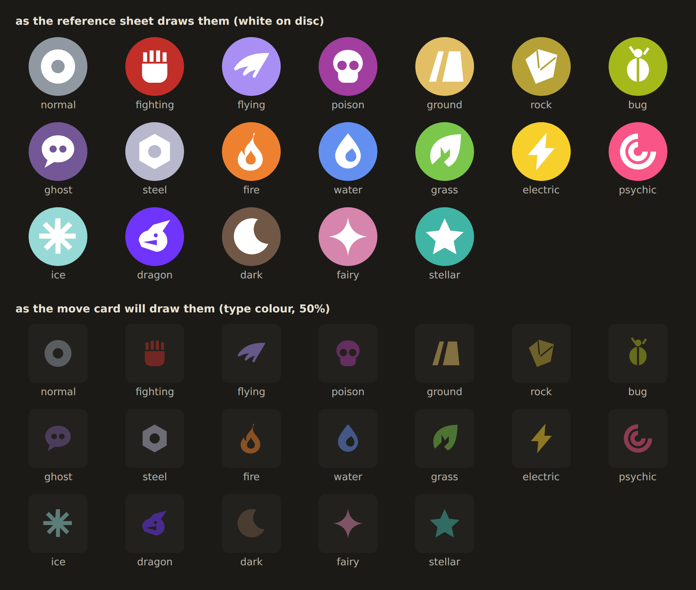
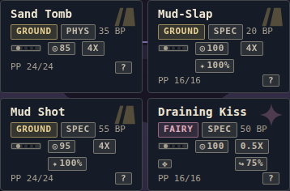

# Chip audit, type/ability sweep, and the move-card type watermark

**2026-09-17**, `claude/serene-bohr-xn433h`. Prompt:
[`../../spec/gymrun-patch-chip-audit-and-move-type-icons.md`](../../spec/gymrun-patch-chip-audit-and-move-type-icons.md).
Deviations and the two superseded rules:
[`../../generation.md`](../../generation.md) section 30.

Presentation only. No `core/` change, no version axis moves, `contentHash`
unmoved.

---

## Part 1 — the archetype chip audit, as found

The rule in force was Patch 4.8.0.3 item 3: the chip appears where there are no
stat bars, and the bars replace it where they exist.

| Surface | file | bars | chip, as found |
|---|---|---|---|
| Battle panels | `scene.ts` | no | yes, via the projection |
| Acquire — the offer | `screens/acquisition.ts:184` | `statLine` | no |
| Acquire — the slot list | `screens/acquisition.ts:252` | no | yes |
| **Learn move — recipient** | `screens/move-replace.ts:100` | **no** | **no** |
| Party screen / drawer / pre-gym lead | `member-card.ts:114` | `statBlock` | no |
| Result summary | `screens/summary.ts:419` | no | yes |
| Item target | `screens/item-target.ts:144` | no | yes |
| Evolution | `screens/evolution.ts:85` | `statLine` | no |
| Starter select | `screens/starter-select.ts:74` | `statLine` | no, span emptied |
| Locale party strip | `screens/locale-select.ts:150` | no | yes, **hand-rolled** |

**One hole and one drift.** The learn-move recipient had neither the chip nor
the bars it was traded for — the screen that decides which of four moves a
Pokemon keeps said least about the Pokemon. And the locale strip built its own
`badge badge--archetype`, which is `.badge`'s metrics with none of `.chip`'s
recipe: bare uppercase text among siblings that all carry the fill and the
hairline outline. `test/chip.test.ts` exists to catch that and did not, because
its regex lists the badge modifiers it knows and this was not one.

The bars are drawn in all three densities, so the trade the rule described was
real everywhere it claimed to be. In Pocket the row is a bar with the number
behind a tap; it is never absent.

### What was built

The author's answer was **chip everywhere, bars or not**, so 4.8.0.3 item 3 is
superseded. The argument, and the failure mode it does not make go away, are in
`generation.md` §30a and in `member-card.ts` at the point where the removal note
used to be.

---

## Part 2 — types and abilities, as found

The tooltip trigger is `data-tip` and nothing else; `ui/tooltips.ts` delegates
from one listener. Keyboard access additionally needs `tabIndex`, because that
file binds `keydown` and an element that never takes focus never receives one.

**Types.** The wheel was reachable from battle move cards and from nowhere else.
Every Pokemon surface took `typeChip` through `screens/starter-select.ts`'s
one-argument wrapper, which passes no tip, and the battle panels took
`scene.panelTypeChip`, which was documented as deliberately inert.

**Abilities**, nine surfaces, four different treatments:

| Treatment | Surfaces | Opens | Keyboard |
|---|---|---|---|
| Real chip with a tip | result summary, battle panel | yes | yes |
| `` with a tip | party card, acquire offer | yes | **no** |
| Plain text in a template string | starter select | **no** | no |
| Absent | learn move, item target, evolution, locale strip | — | — |

The `` row is the one worth naming: present in the source, absent in use
for anyone not holding a mouse.

### What was built

The author's answer was **types on mon surfaces, abilities everywhere**.

- `ui/chip.ts` gains `monTypeChip` — a Pokemon's type, with the wheel. The split
  is two functions rather than a flag because the call sites are all
  `types.map(…)` and a one-parameter function cannot be handed an index by
  mistake.
- `ui/chip.ts` gains `abilityChip` — one builder, focusable, used on all nine.
- Gym leader, locale, threat and item-boost type chips keep no trigger: those
  are forecasts about content the player has not reached.

### The objection this leaves open

`scene.ts` carried a longer argument than the ruling quoted in the question, and
from a playtester: on a Pokemon panel the wheel answers *"what does Water do
offensively"* beside a Pokemon whose four moves are drawn off-species and
predict nothing of the kind.

That argument is better evidenced than the one the decision was taken against,
so it is preserved verbatim in the source rather than deleted. What it
establishes is that the wheel's **offensive** half is misleading on a Pokemon
badge. It does not establish that the **defensive** half is, and the defensive
half is the question a player asks of the thing standing opposite them.

**The one-line follow-up, if this reads wrong in play:** have a Pokemon badge
open the defending half only. Not built — it was not what was asked for.

---

## Part 3 — the move-card type watermark

Top half is the reference vocabulary; bottom half is the tint and opacity the
move card actually uses.

**Three things changed after being looked at**, which is the reason this sheet
exists rather than a paragraph claiming the glyphs are fine:

1. **Bug** was one silhouette with the elytra split cut out of it. Even-odd
   rendered that as a hairline outline — it read as a stick figure. Separate
   solids now.
2. **Dragon** read as a rocket in the first draft and a pen nib in the second.
   The pointed snout was doing it. It is blunt now, and it is still the weakest
   glyph of the nineteen — the one to revisit first.
3. **Placement.** The mark first sat at the button's vertical centre, which is
   where the fact chips are; they painted over its left half and it read as a
   clipped icon rather than a background. It sits in the corner beside the name
   now, and `.moves .move__name` yields 34px so that corner is reliably empty.
   In the four-column bar there is no corner to yield, so it becomes a centred
   wash at 0.6 of the token instead.

**Opacity.** The brief set a ceiling of 50%. It is a token, `--move-watermark`,
and `test/type-icons.test.ts` asserts the ceiling rather than a comment claiming
it. It ships at **0.3** — at 0.5 the glyph competes with the move name.

**It is redundant on purpose.** The type is already on the button in words. So
it is `aria-hidden`, has no tooltip, comes off entirely on a disabled button and
under `prefers-contrast: more`, and an unknown type draws nothing rather than a
fallback mark.

---

## What broke, and how it was found

`.replace__owner` was a species, a level and two type chips on one line at 390
with room to spare. The two new chips overflowed it: the ability ran off the
right edge and the sprite was pushed out of the viewport. It wraps now and
reserves the sprite's gutter off `--figure-size`.

**Found by screenshotting the surfaces, not by a test** — and the reason is
worth more than the bug. `scripts/smoke.mjs` already asserts
`documentElement.scrollWidth <= innerWidth`, and no ancestor of a screen clips
horizontally, so **that assertion would have caught this**. It runs on the
locale screen, the map and a battle. `replace` is none of those, and neither
are the other eight screens.

So the defect is not "untested", it is "the guard is pointed at a hand-picked
list of three and nothing asserts the list is complete" — which is exactly the
property `test/visual-chips.test.ts` holds for chip variants and this one does
not. Filed in [`../../README.md`](../../README.md) section 5, "Carried out of
the chip audit", with the two things that make it more than a one-off: the bench
row is the one `.figure` host with no gutter reserved, and the three gutters
that do exist are scoped out of Pocket, which is the mode with the narrowest
columns and no overflow assertion running in it at all.

## A test that was deleted rather than loosened

`test/type-icons.test.ts` was first written with a bounds assertion that read
every number out of the path data and checked it was inside the 24-unit box.
That is not what those numbers are — a lowercase path command takes relative
deltas, an arc takes radii and flags before its endpoint — and it called the
Normal ring's legal `-7.4` an escape. A real check needs a path parser or
`getBBox`, and neither speaks to the thing that actually matters about these
glyphs, which is whether a person can tell them apart. That was done by
rendering all nineteen and looking. The file says so where the assertion was.

## Cost

One inconsistency is left standing, inside the answered scope rather than
outside it: **a move's type chip on the starter card and the party card opens
nothing, while the same chip on a battle move card opens the wheel.** The
question answered was about Pokemon type badges, and a move's type is neither
that nor a gym leader's forecast. Left alone rather than widened silently.

The locale party strip is the one surface that got visibly taller: six members
at one line each became six at two, which pushes the region cards down. The
ability is the least load-bearing fact on a screen that is choosing a region
rather than a Pokemon, so that strip is the first place to drop it back if the
screen feels long.
