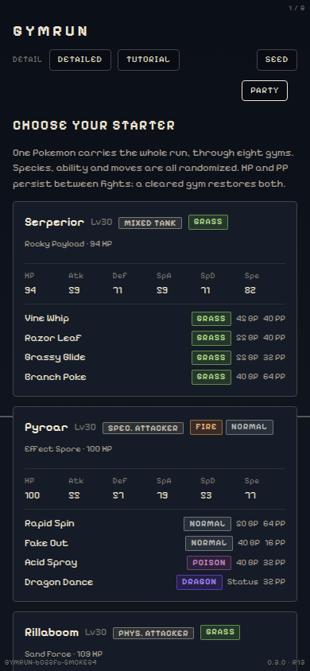
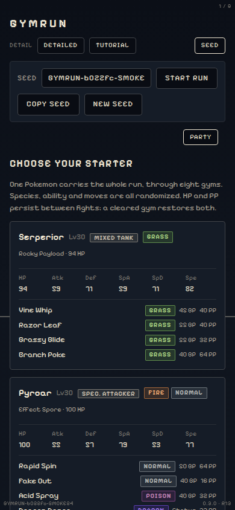

# The mobile seed bar patch

Prompt: [`../../spec/gymrun-patch-mobile-seed-bar.md`](../../spec/gymrun-patch-mobile-seed-bar.md).
Deviation record: `../../generation.md` section 12k.

Built at 390x844 on `SMOKE24`, the starter screen, tutorial skipped, from the
production build via `scripts/visual/browser.mjs`.

| collapsed, as every run starts | after one tap of Seed |
|---|---|
|  |  |

The heights the vertical budget guards (`docs/visual/baseline/heights.json`)
are unchanged to the pixel: the toggle is on the header's existing control row,
so the map and the battle see no new height. `test/visual-v2.test.ts` says so
and `test/visual-phone-seed-bar.test.ts` holds the rest.
